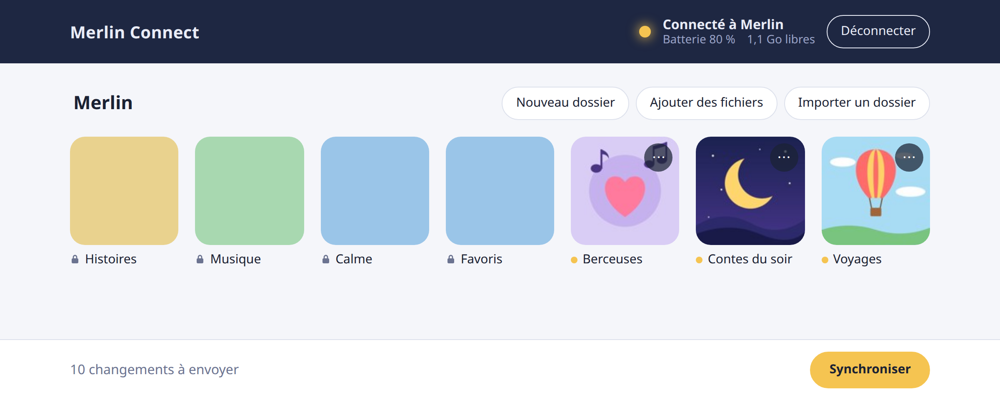
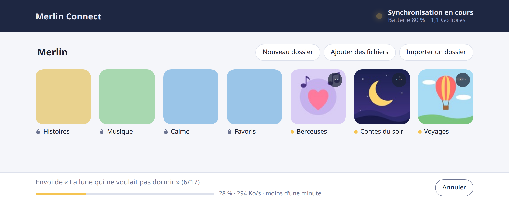
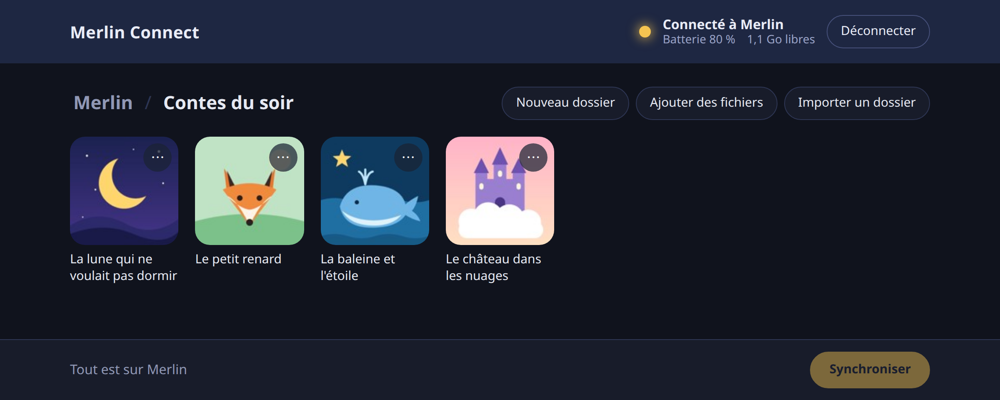

# Merlin Connect

Ajouter deux ou trois histoires sur une enceinte Merlin ne devrait pas ressembler à une
opération à cœur ouvert. 😬

Merlin Connect le fait en WiFi, depuis votre navigateur : glissez quelques MP3, cliquez
sur Synchroniser, et retournez à votre café. Le contenu officiel reste intact, et si
l'application officielle efface vos histoires, une synchronisation suffit à les ramener.

## Fonctionnalités

- Import de MP3 ou de dossiers entiers, par glisser-déposer ou avec le sélecteur.
- Images trouvées toutes seules : image du même nom, pochette du MP3 ou image du dossier.
- Dossiers et sous-dossiers : renommer, déplacer, réordonner, changer l'image, supprimer.
- Contenu officiel en lecture seule, jamais modifié.
- Synchronisation en un clic, avec progression, débit et temps restant.
- Changements préparés hors connexion, envoyés à la prochaine synchronisation.
- Batterie et espace libre de Merlin affichés.
- Copie de la liste de Merlin avant chaque synchronisation.
- Aucun compte Merlin demandé.

## Utilisation

1. Téléchargez-le pour Linux ou Windows depuis les
   [releases](https://github.com/JoN1oP/merlin-connect/releases), ou compilez-le :
   `go build ./cmd/merlin-connect` (Go 1.26).
2. Lancez-le : il s'ouvre dans votre navigateur.
3. Cliquez sur **Connecter** et suivez les instructions.
4. Ajoutez des dossiers et des histoires (MP3), puis cliquez sur **Synchroniser**.

Votre bibliothèque est rangée dans `~/.local/share/merlin-connect` sous Linux (`-data` pour
la déplacer).

Gratuit pour un usage non commercial ([PolyForm Noncommercial 1.0.0](LICENSE)). Sans lien
avec Merlin. À utiliser à vos risques et périls.
